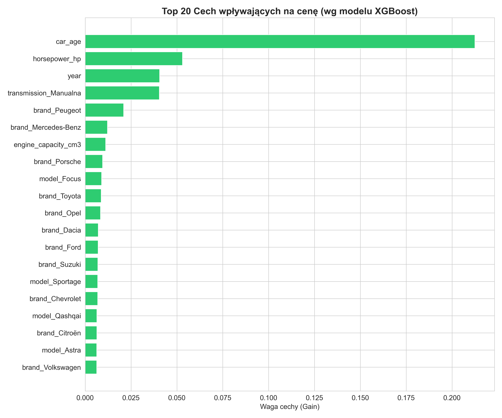
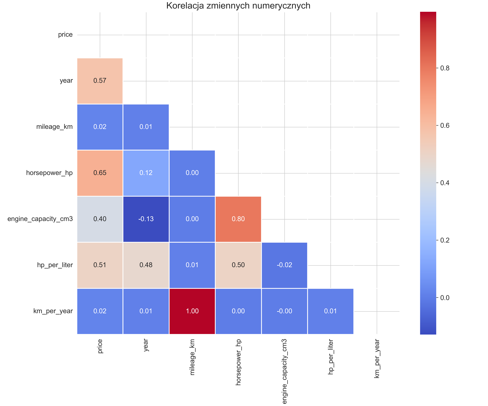
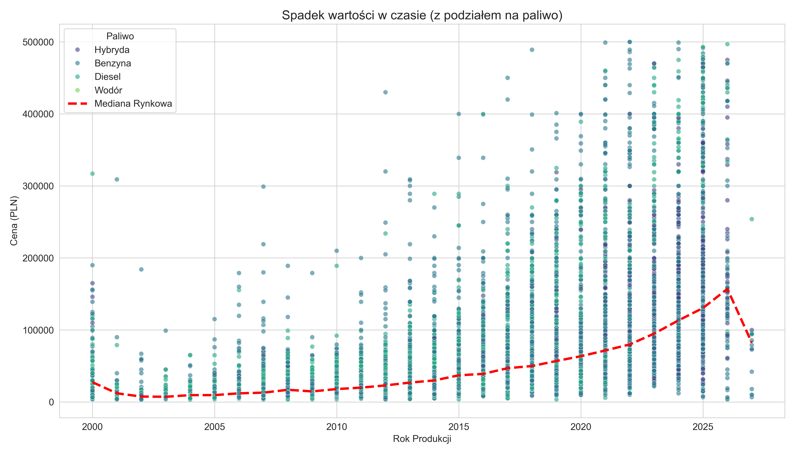

# 🚗 AutoMarket Pro: AI-Powered Car Price Prediction


**AutoMarket Pro** is an advanced Machine Learning application designed to estimate the market value of used cars in Poland. It leverages **XGBoost** and extensive **Feature Engineering** to analyze thousands of listings from Otomoto, providing precise valuations and deep market insights.

---

## 🚀 Live Demo
**[Click here to view the App on Streamlit Cloud](https://car-price-prediction-using-ml-automarket-ebnfq7gdfjmxdfpatjred.streamlit.app/)**

---

## 📊 Data Insights & Visualizations
Below are the key analytical findings generated from the dataset used to train the model.

### 1. What Drives the Price? (Feature Importance)
The **XGBoost** model identified the most critical factors influencing car prices. As expected, **Year (Production Year)** and **Engine Power (HP)** are dominant, but derived features like `hp_per_liter` play a significant role.


### 2. Market Correlation Matrix
An analysis of relationships between numerical variables. We can observe a strong negative correlation between **Mileage** and **Price**, and a positive correlation between **Horsepower** and **Price**.


### 3. Impact of Equipment (NLP Analysis)
Using Text Mining techniques, we extracted features like **4x4 Drive** and **Sport Packages** (M-Pakiet, AMG, S-Line) from listings. The chart below proves that cars with these features hold significantly higher value.


### 4. Depreciation Curve
Visualizing how car value decreases over time. The model accounts for this non-linear trend using the `Age²` feature.


### 5. Brand Price Distribution
A comparison of the top 15 most popular brands in the dataset. Premium brands (BMW, Audi, Mercedes) show a much wider price range compared to budget-friendly options (Opel, Ford).


---

## 🎯 Key Features

### 1. 💰 Intelligent Valuation Calculator
* Predicts car price based on brand, model, year, mileage, power, capacity, and fuel type.
* **Smart Analysis:** Accounts for non-linear depreciation (`Age²`) and engine stress (`HP/Liter`).
* **Error Margin:** Calculates confidence intervals (Price ± MAE).

### 2. 📊 Market Analytics Dashboard
* **Feature Importance:** visualizes which factors (Year, Power, Brand) drive the price the most.
* **Depreciation Curves:** interactive charts showing value loss over time.
* **Mileage Impact:** analysis of how kilometers affect resale value across different fuel types.

### 3. 🏆 Brand Benchmarking
* **Power Economy:** Rankings of brands offering the cheapest horsepower (PLN per 1 HP).
* **Fuel Structure:** Breakdown of diesel/petrol/hybrid distribution per manufacturer.
* **Violin Plots:** Price density visualization for top brands.

---

## 🧠 Machine Learning Workflow

The project follows a rigorous Data Science pipeline:

### 1. Data Collection (Web Scraping)
* Data scraped from **Otomoto.pl** (Polish market).
* Stored raw data in **MongoDB**.

### 2. Data Cleaning & ETL
* Filtering outliers (e.g., damaged cars, price errors).
* Handling missing values and duplicates.
* Restricting data to realistic ranges (Year: 2000–2026).

### 3. Feature Engineering
We didn't just throw raw data into the model. We created derived features to capture real-world car logic:
* **`car_age_squared`**: Captures the rapid value loss in early years.
* **`hp_per_liter`**: Indicates engine performance/stress (crucial for sports cars vs. city cars).
* **`km_per_year`**: Intensity of usage.
* **NLP / Text Mining:** Extracted keywords from titles (e.g., *Quattro*, *M-Package*, *AMG*, *Accident-free*) to refine predictions.

### 4. Model Training
* **Algorithm:** XGBoost Regressor (Extreme Gradient Boosting).
* **Encoding:** One-Hot Encoding for categorical variables (Brand, Model, Fuel, etc.).
* **Performance:**
    * **R² Score:** ~0.91 (Explains 91% of price variance).
    * **MAE (Mean Absolute Error):** ~11,300 PLN.

---

## 🛠️ Tech Stack

* **Language:** Python 3.x
* **Web Framework:** Streamlit
* **Machine Learning:** XGBoost, Scikit-Learn
* **Data Manipulation:** Pandas, NumPy
* **Visualization:** Plotly Express, Seaborn, Matplotlib
* **Database:** MongoDB (Local), CSV (Deployment)

---

## 📂 Project Structure

```bash
├── app.py                  # Main Streamlit application
├── analiza.py              # ML Pipeline: ETL, Training, Tuning
├── generuj_wykresy.py      # Script to generate static PNG charts
├── requirements.txt        # Python dependencies
├── baza_aut_clean.csv      # Processed dataset for the App
├── model_ceny_aut.pkl      # Trained XGBoost model
├── model_kolumny.pkl       # Feature columns list
├── mapa_marka_model.pkl    # Dictionary for dynamic dropdowns
└── README.md               # Project documentation
```

---

## 💿 Installation & Local Run

1. Clone the repository:
```bash
git clone [https://github.com/SkrytyZubr/car-price-prediction-using-ml-automarket.git](https://github.com/SkrytyZubr/car-price-prediction-using-ml-automarket.git)
cd car-price-prediction-using-ml-automarket
```

2. Install dependencies:
```bash
pip install -r requirements.txt
```

3. Run the App:
```bash
streamlit run app.py
```

## 📈 Future Improvements

* **Deep Learning integration (Neural Networks) for price prediction.**

* **Real-time API connection to live listings.**

* **Image recognition to assess car condition from photos.**